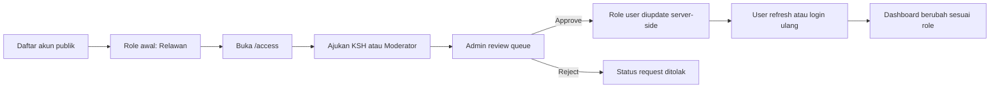
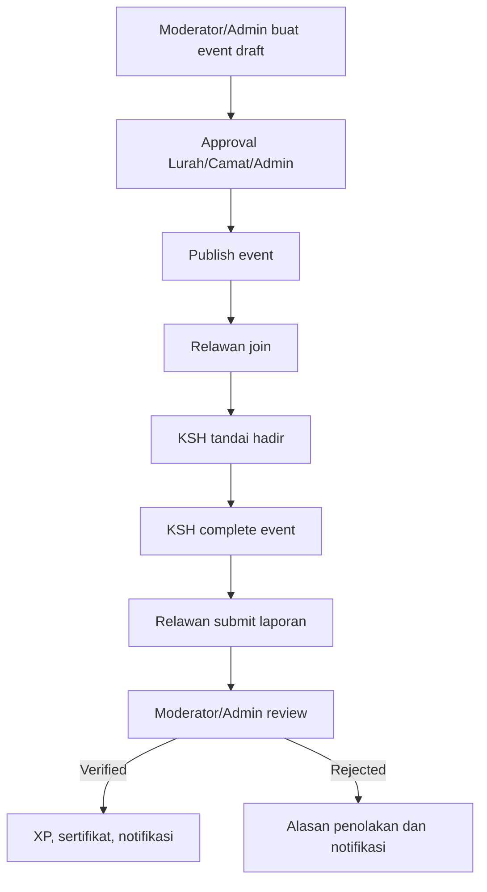
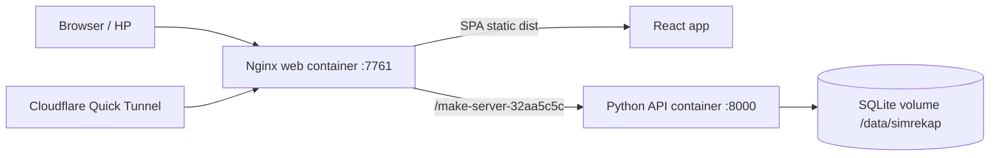
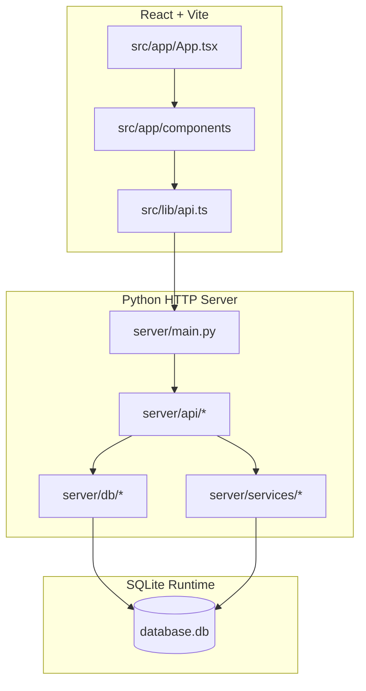

# SIMREKAP

**Sistem Informasi Manajemen Relawan Kampung Pancasila**

SIMREKAP adalah prototype aplikasi web untuk mengelola relawan, kegiatan kampung, laporan partisipasi, XP, sertifikat digital, voucher transportasi, notifikasi, kolaborasi mitra, dan approval akses petugas. Proyek ini dikembangkan sebagai bahan Kerja Praktik oleh Farchan Deano untuk kebutuhan demo, evaluasi, dan dokumentasi teknis.

Repository aktif: `lustresense/xpcentric-web` branch `main`.

> Catatan nama teknis: beberapa environment variable dan API prefix masih memakai nama historis `SIMRP` untuk menjaga kompatibilitas runtime. Nama produk dan dokumentasi publik menggunakan SIMREKAP.

## Daftar Isi

- [Gambaran Produk](#gambaran-produk)
- [Fitur Utama](#fitur-utama)
- [Alur Sistem](#alur-sistem)
- [Arsitektur](#arsitektur)
- [Tech Stack](#tech-stack)
- [Menjalankan Lokal](#menjalankan-lokal)
- [Menjalankan dengan Docker](#menjalankan-dengan-docker)
- [Demo Accounts](#demo-accounts)
- [Environment Variable](#environment-variable)
- [API Ringkas](#api-ringkas)
- [Struktur Folder](#struktur-folder)
- [Validasi](#validasi)
- [Dokumentasi Tambahan](#dokumentasi-tambahan)
- [Status Produksi](#status-produksi)

## Gambaran Produk

SIMREKAP menyimulasikan sistem administrasi partisipasi warga Surabaya pada program kampung. Relawan dapat mendaftar kegiatan, hadir, mengirim laporan, memperoleh XP, melihat leaderboard, mendapat sertifikat, dan menukar XP menjadi voucher transportasi. KSH dan ASN/moderator mengelola kegiatan serta memverifikasi laporan sesuai kewenangan wilayah. Admin mengawasi data pengguna, event, laporan, pengajuan akses, role, dan penyesuaian sementara.

Target penggunaan saat ini:

- Demo Kerja Praktik.
- Presentasi prototype ke kampus dan pemangku kepentingan.
- Basis teknis untuk pengembangan lanjutan.
- Simulasi alur operasional relawan, KSH, ASN, dan admin.

## Fitur Utama

| Area | Fitur |
|---|---|
| Auth | Register relawan, login user/moderator, login admin, session token, logout |
| Role | Relawan, KSH, Moderator T1, Moderator T2 Lurah/Camat, Moderator T3, Admin |
| Access Portal | Halaman `/access` untuk pengajuan akses KSH/moderator melalui approval admin |
| Event | Draft, approval, publish, join, attendance, complete |
| Laporan | Submit laporan, under review, verify/reject, alasan penolakan |
| XP | XP user, XP kelurahan, XP empat pilar, leaderboard |
| Sertifikat | Record sertifikat, preview, download HTML siap print/PDF, public verify |
| Reward | Katalog voucher GoBis/Suroboyo Bus, redeem server-side, stok dan XP aman |
| Admin | Database-style dashboard, filter/search/sort, queue pengajuan akses, kontrol role |
| Notifikasi | Unread count, list notifikasi, mark read, shared hook desktop/mobile |
| Audit | Audit log untuk aksi penting admin/moderator |
| Docker | Image GHCR `ghcr.io/lustresense/simrekap:api-demo` dan `web-demo` |

## Alur Sistem

### Role dan Akses

Register publik selalu membuat akun relawan. Role KSH atau moderator tidak aktif otomatis. User harus mengajukan akses melalui `/access`, lalu admin menyetujui atau menolak request tersebut.



### Event dan Laporan



### Deployment Docker Demo



## Arsitektur

Backend berjalan dengan Python standard library `ThreadingHTTPServer`. `server/main.py` hanya menjadi entry point, konfigurasi, session, dependency wiring, CORS/security headers, dan dispatch ke modul API. Business logic endpoint berada di `server/api/*`; schema/migration/seed berada di `server/db/*`; helper runtime berada di `server/services/*`.

Frontend memakai React + Vite dengan router berbasis state di `src/app/App.tsx`. Dashboard besar sudah dipisah menjadi modul domain agar mudah dibaca dan diubah.



## Tech Stack

Frontend:

- React 18
- Vite 6
- TypeScript/TSX
- Tailwind CSS utility classes
- Radix UI primitives
- Lucide React icons
- Recharts
- Sonner
- Motion

Backend:

- Python 3.11 compatible
- `http.server.ThreadingHTTPServer`
- `sqlite3`
- PBKDF2-HMAC-SHA256 password hashing
- Bearer session token stored server-side
- Modular API handlers

Runtime:

- SQLite for prototype/KP/demo
- Docker Compose two-service deployment
- Nginx web container proxying API prefix to backend container
- Optional Cloudflare Quick Tunnel for phone/external demo access

## Menjalankan Lokal

Install dependency:

```bash
npm install
```

Jalankan frontend dan backend lokal:

```bash
npm run dev
```

URL lokal:

```text
Frontend: http://localhost:5173
Admin:    http://localhost:5173/admin
Access:   http://localhost:5173/access
Backend:  http://127.0.0.1:8000/make-server-32aa5c5c
```

Perintah lain:

```bash
npm run api       # backend saja
npm run dev:web   # frontend Vite saja
npm run build     # build frontend
npm run smoke     # smoke test backend
```

Jika credential demo tidak disediakan lewat env, backend development membuat credential lokal di:

```text
database/runtime/dev_credentials.txt
```

File tersebut di-ignore dan tidak boleh di-commit.

## Menjalankan dengan Docker

Compose default memakai port host `7761`.

```bash
docker compose pull
docker compose up -d
curl http://localhost:7761/make-server-32aa5c5c/health
```

URL demo:

```text
Web:   http://localhost:7761
Admin: http://localhost:7761/admin
API:   http://localhost:7761/make-server-32aa5c5c
```

Image GHCR:

```text
ghcr.io/lustresense/simrekap:api-demo
ghcr.io/lustresense/simrekap:web-demo
```

Data SQLite persisten di volume Docker:

```text
/data/simrekap/database.db
/data/simrekap/dev_credentials.txt
```

Runbook server lengkap ada di [docs/SERVER_DOCKER_RUNBOOK.md](docs/SERVER_DOCKER_RUNBOOK.md).

## Demo Accounts

Jika `SIMRP_ENABLE_DEMO_SEED=true`, sistem membuat akun demo:

| Nama | Email | Role |
|---|---|---|
| Andi Relawan | `relawan.demo@simrp.app` | Relawan |
| Nia Relawan | `relawan2.demo@simrp.app` | Relawan |
| Budi Relawan | `relawan3.demo@simrp.app` | Relawan |
| Kak Esa | `ksh.demo@simrp.app` | KSH |
| Pak Raka ASN | `moderator1.demo@simrp.app` | Moderator T1 |
| Bu Sinta Lurah | `moderator2.demo@simrp.app` | Moderator T2 Lurah |
| Pak Dimas Camat | `moderator2.camat@simrp.app` | Moderator T2 Camat |
| Pak Arif | `moderator3.demo@simrp.app` | Moderator T3 |
| Administrator | `admin@simrp.local` | Admin |

Password demo berasal dari `SIMRP_DEMO_PASSWORD` atau credential development yang dibuat otomatis.

Admin portal:

```text
URL: /admin
Username: SIMRP_ADMIN_LOGIN_USERNAME
Password: SIMRP_ADMIN_LOGIN_PASSWORD
```

## Environment Variable

| Env | Fungsi |
|---|---|
| `SIMRP_ENV` | `development` atau `production` |
| `SIMRP_HOST` | Host backend |
| `SIMRP_PORT` | Port backend |
| `SIMRP_DB_PATH` | Path SQLite runtime |
| `SIMRP_ENABLE_DEMO_SEED` | Seed akun dan data demo |
| `SIMRP_DEMO_PASSWORD` | Password akun demo |
| `SIMRP_ADMIN_LOGIN_USERNAME` | Username portal admin |
| `SIMRP_ADMIN_LOGIN_PASSWORD` | Password portal admin |
| `SIMRP_SEED_ADMIN_PASSWORD` | Password akun admin bootstrap |
| `SIMRP_ALLOWED_ORIGINS` | CORS allowlist production |
| `SIMRP_PBKDF2_ITERATIONS` | Iterasi hash password |
| `SIMRP_SESSION_TTL_HOURS` | Masa aktif session |
| `SIMRP_RATE_LIMIT_WINDOW_SECONDS` | Window rate limit |
| `SIMRP_RATE_LIMIT_AUTH_MAX` | Limit request auth |
| `SIMRP_RATE_LIMIT_MUTATION_MAX` | Limit request mutasi |
| `SIMRP_MAX_BODY_BYTES` | Batas body request |
| `VITE_API_BASE_URL` | Override API base URL frontend |

Untuk Docker demo, frontend production memakai same-origin API path `/make-server-32aa5c5c`, sehingga tidak perlu mengubah domain API ketika dibuka lewat tunnel.

## API Ringkas

Base path:

```text
/make-server-32aa5c5c
```

| Area | Endpoint |
|---|---|
| Health | `GET /health` |
| Auth | `POST /auth/signup`, `POST /auth/login`, `POST /auth/admin-login`, `GET /auth/me`, `POST/DELETE /auth/logout` |
| Users | `GET /users`, `PUT /users/{id}`, `GET /users/me/participations` |
| Events | `GET/POST /events`, `PUT /events/{id}`, `POST /events/{id}/approval`, `POST /events/{id}/publish`, `POST /events/{id}/join`, `POST /events/{id}/attendance`, `POST /events/{id}/complete` |
| Reports | `GET/POST /reports`, `POST /reports/{id}/review`, `POST /reports/{id}/verify` |
| Access | `POST /access-requests`, `GET /access-requests/me`, `GET /admin/access-requests`, `POST /admin/access-requests/{id}/review` |
| Collaboration | `GET/POST /collaboration-requests`, `POST /collaboration-requests/{id}/approval` |
| Notifications | `GET /notifications`, `GET /notifications/count`, `POST /notifications/{id}/read` |
| Certificates | `GET /certificates`, `GET /certificates/{id}/verify`, `GET /certificates/{id}/download` |
| Rewards | `GET /rewards/catalog`, `POST /rewards/redeem` |
| Geographic | `GET /geo/options`, `GET /geo/stats`, `GET /kodepos/{code}`, `GET /kampung`, `GET /kampung/{id}/pillars` |
| Landing | `GET /landing/leaderboard` |

Referensi lengkap ada di [docs/API_REFERENCE.md](docs/API_REFERENCE.md).

## Struktur Folder

```text
server/
  main.py                  Entry point HTTP server dan dispatch API
  api/                     Endpoint aktif per domain
  core/                    Config, database/security compatibility, pure utils
  db/                      SQLite schema, migration, seed
  services/                Session, password hash, audit, notification, XP, rate limiter
  legacy/                  Kode lama yang tidak dipakai runtime aktif

src/
  app/App.tsx              SPA shell dan routing berbasis state
  app/components/          Halaman, dashboard, UI modules
  app/components/admin/    Admin dashboard modules
  app/components/user/     User dashboard modules
  app/components/moderator/ Moderator dashboard modules
  data/                    Geographic data, leveling, badges
  lib/api.ts               Centralized API client
  types/index.ts           Type definitions payload aktif

docs/
  API_REFERENCE.md
  ARCHITECTURE.md
  DEPLOYMENT.md
  SERVER_DOCKER_RUNBOOK.md
  PRODUCTION_READINESS.md
  PRODUCTION_GAP_ROADMAP.md
  PRIVACY_AND_DATA_GOVERNANCE.md
  OPERATIONS_RUNBOOK.md
  MAINTAINER_GUIDE.md
```

## Validasi

Frontend:

```bash
npm run build
```

Backend:

```bash
python -m py_compile server/main.py
```

Smoke test:

```bash
npm run smoke
```

Git whitespace check:

```bash
git diff --check
```

Docker:

```bash
docker compose build
docker compose up -d
curl http://localhost:7761/make-server-32aa5c5c/health
```

## Dokumentasi Tambahan

| Dokumen | Isi |
|---|---|
| [docs/README.md](docs/README.md) | Index dokumentasi |
| [docs/ARCHITECTURE.md](docs/ARCHITECTURE.md) | Arsitektur teknis |
| [docs/API_REFERENCE.md](docs/API_REFERENCE.md) | Endpoint API |
| [docs/DEPLOYMENT.md](docs/DEPLOYMENT.md) | Deployment umum |
| [docs/SERVER_DOCKER_RUNBOOK.md](docs/SERVER_DOCKER_RUNBOOK.md) | Langkah Docker server dan tunnel |
| [docs/DEMO_ACCOUNTS.md](docs/DEMO_ACCOUNTS.md) | Akun dan skenario demo |
| [docs/PRODUCTION_READINESS.md](docs/PRODUCTION_READINESS.md) | Status kesiapan produksi |
| [docs/PRODUCTION_GAP_ROADMAP.md](docs/PRODUCTION_GAP_ROADMAP.md) | Gap menuju produksi publik |
| [SECURITY.md](SECURITY.md) | Kebijakan keamanan repository |
| [CONTRIBUTING.md](CONTRIBUTING.md) | Panduan kontribusi |
| [CHANGELOG.md](CHANGELOG.md) | Riwayat perubahan |

## Status Produksi

SIMREKAP saat ini siap untuk demo prototype dan evaluasi teknis. Untuk penggunaan publik warga Surabaya skala besar, gap berikut tetap perlu diselesaikan sebelum klaim produksi penuh:

- OTP/SMS resmi atau identity verification resmi.
- Monitoring, logging, backup, restore drill, dan alerting operasional.
- Database server managed jika beban melebihi batas aman SQLite.
- Review legal, privacy, dan data retention.
- Integrasi resmi GoBis jika voucher menjadi transaksi nyata.
- Sertifikat dengan tanda tangan digital/legal formal jika diperlukan.

Detail gap ada di [docs/PRODUCTION_GAP_ROADMAP.md](docs/PRODUCTION_GAP_ROADMAP.md).

## Lisensi

Lihat [LICENSE.md](LICENSE.md). Repository ini tidak diposisikan sebagai software bebas pakai publik tanpa izin.
