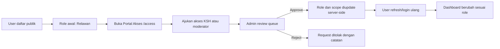
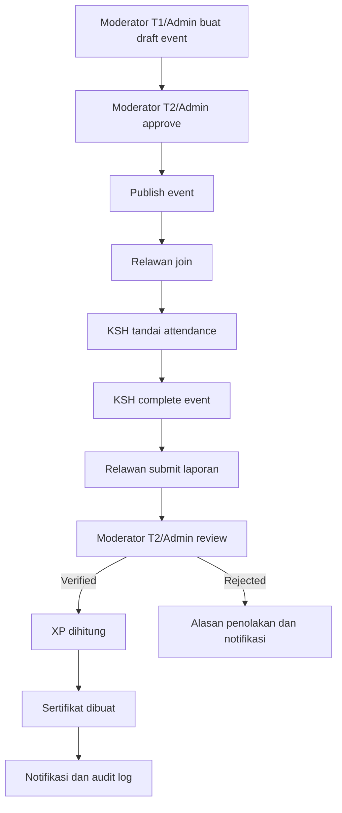
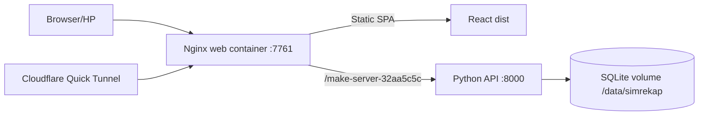
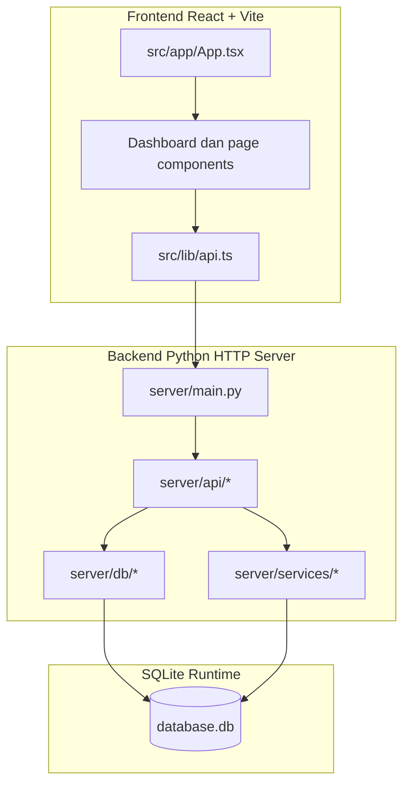

# SIMREKAP

**Sistem Informasi Manajemen Relawan Kampung Pancasila**

SIMREKAP adalah prototype aplikasi web untuk mengelola relawan, kegiatan kampung, laporan partisipasi, XP, sertifikat digital, voucher transportasi, kolaborasi mitra, notifikasi, dan approval akses petugas. Repository ini disiapkan sebagai paket serah-terima teknis untuk kebutuhan Kerja Praktik, demo, evaluasi, dan pengembangan lanjutan oleh tim teknis.

Repository aktif:

```text
GitHub: lustresense/xpcentric-web
Branch: main
```

Catatan kompatibilitas: beberapa environment variable dan API prefix masih memakai nama historis `SIMRP` agar runtime lama tidak rusak. Nama produk, dokumen, dan konteks serah-terima memakai **SIMREKAP**.

## Daftar Isi

- [Gambaran Sistem](#gambaran-sistem)
- [Stakeholder dan Role](#stakeholder-dan-role)
- [Fitur Utama](#fitur-utama)
- [Alur Bisnis](#alur-bisnis)
- [Arsitektur Teknis](#arsitektur-teknis)
- [Quick Start Lokal](#quick-start-lokal)
- [Docker Demo Runtime](#docker-demo-runtime)
- [Akun Demo dan Database Sample](#akun-demo-dan-database-sample)
- [Environment Variable Utama](#environment-variable-utama)
- [Struktur Repository](#struktur-repository)
- [Validasi](#validasi)
- [Dokumentasi Serah-Terima](#dokumentasi-serah-terima)
- [Batas Prototype dan Roadmap Produksi](#batas-prototype-dan-roadmap-produksi)

## Gambaran Sistem

SIMREKAP dibuat untuk mensimulasikan proses digitalisasi partisipasi warga pada program Kampung Pancasila. Sistem ini memusatkan data kegiatan, relawan, laporan, verifikasi, apresiasi, dan kolaborasi agar proses administrasi tidak bergantung pada pencatatan manual.

Tujuan utama:

1. Mempermudah relawan menemukan dan mengikuti kegiatan kampung.
2. Memudahkan KSH/ASN melakukan pengelolaan kegiatan dan validasi laporan.
3. Menyediakan rekap kontribusi dalam bentuk XP, leaderboard, sertifikat, dan voucher demo.
4. Menyediakan dashboard admin untuk melihat data, mengelola akses, dan melakukan kontrol operasional.
5. Menjadi baseline prototype yang bisa dipahami, dijalankan, dan dikembangkan ulang oleh tim IT.

## Stakeholder dan Role

| Stakeholder | Role sistem | Kewenangan utama |
|---|---|---|
| Warga/Relawan | `user` | Register, join event, submit laporan, melihat XP, sertifikat, reward |
| KSH | `ksh` | Menjalankan flow relawan dan membantu attendance/complete event |
| ASN pembuat kegiatan | `moderator_t1` | Membuat draft event sesuai scope wilayah |
| Lurah/Camat | `moderator_t2` | Approve/publish event dan verify/reject laporan sesuai scope |
| Moderator lanjutan | `moderator_t3` | Role perluasan prototype untuk kebutuhan lanjutan |
| Admin | `admin` | Mengelola database, access request, role, audit, dan dashboard admin |
| Mitra | public form | Mengajukan dukungan dana/konsumsi/peralatan/media/lainnya |

Register publik selalu menghasilkan role awal `user`. KSH dan moderator tidak bisa aktif otomatis; akses tersebut harus diajukan melalui Portal Akses Petugas dan disetujui admin.

## Fitur Utama

| Domain | Fitur |
|---|---|
| Auth | Register relawan, login user/moderator, login admin, session token, logout |
| OTP | Fondasi OTP provider-ready, mode development untuk demo |
| Access Portal | `/access` untuk pengajuan KSH/moderator dan review admin |
| Event | Draft, approval, publish, join, attendance, complete |
| Report | Submit laporan, under review, verify/reject, alasan penolakan |
| XP | XP user, XP kelurahan, XP empat pilar, leaderboard |
| Certificate | Preview, download HTML siap print/PDF, public verify |
| Reward | Voucher GoBis/Suroboyo Bus sebagai simulasi redeem XP |
| Collaboration | Public partner request dan approval/reject oleh petugas |
| Notification | Unread count, daftar notifikasi, mark read |
| Audit | Audit log untuk aksi penting admin/moderator |
| Docker | Runtime demo `web` + `api` memakai SQLite volume |

## Alur Bisnis

### Role Approval


```mermaid
flowchart LR
    A[User daftar publik] --> B[Role awal: Relawan]
    B --> C[Buka Portal Akses /access]
    C --> D[Ajukan akses KSH atau moderator]
    D --> E[Admin review queue]
    E -->|Approve| F[Role dan scope diupdate server-side]
    E -->|Reject| G[Request ditolak dengan catatan]
    F --> H[User refresh/login ulang]
    H --> I[Dashboard berubah sesuai role]
```

### Event, Laporan, XP, Sertifikat


```mermaid
flowchart TD
    A[Moderator T1/Admin buat draft event] --> B[Moderator T2/Admin approve]
    B --> C[Publish event]
    C --> D[Relawan join]
    D --> E[KSH tandai attendance]
    E --> F[KSH complete event]
    F --> G[Relawan submit laporan]
    G --> H[Moderator T2/Admin review]
    H -->|Verified| I[XP dihitung]
    I --> J[Sertifikat dibuat]
    J --> K[Notifikasi dan audit log]
    H -->|Rejected| L[Alasan penolakan dan notifikasi]
```

### Docker Demo


```mermaid
flowchart LR
    U[Browser/HP] --> W[Nginx web container :7761]
    W -->|Static SPA| F[React dist]
    W -->|/make-server-32aa5c5c| A[Python API :8000]
    A --> D[(SQLite volume /data/simrekap)]
    T[Cloudflare Quick Tunnel] --> W
```

## Arsitektur Teknis


```mermaid
flowchart TB
    subgraph FE[Frontend React + Vite]
        App[src/app/App.tsx]
        Components[Dashboard dan page components]
        ApiClient[src/lib/api.ts]
    end

    subgraph BE[Backend Python HTTP Server]
        Main[server/main.py]
        Api[server/api/*]
        Services[server/services/*]
        DbLayer[server/db/*]
    end

    subgraph Data[SQLite Runtime]
        DB[(database.db)]
    end

    App --> Components
    Components --> ApiClient
    ApiClient --> Main
    Main --> Api
    Api --> Services
    Api --> DbLayer
    DbLayer --> DB
    Services --> DB
```

Frontend memakai React 18, Vite, Tailwind utility classes, Radix UI primitives, Lucide icons, Recharts, Sonner, dan Motion. Backend memakai Python standard library `ThreadingHTTPServer`, SQLite, PBKDF2-HMAC-SHA256, session token server-side, modul API per domain, dan service helper terpisah.

## Quick Start Lokal

Prasyarat:

- Node.js 20 atau versi LTS kompatibel.
- Python 3.11+.
- Git.

Install dependency:

```bash
npm install
```

Jalankan backend dan frontend lokal:

```bash
npm run dev
```

URL lokal:

```text
Frontend: http://localhost:5173
Admin:    http://localhost:5173/admin
Access:   http://localhost:5173/access
Backend:  http://127.0.0.1:8000/make-server-32aa5c5c
```

Perintah penting:

```bash
npm run api       # backend saja
npm run dev:web   # frontend saja
npm run build     # build frontend
npm run smoke     # smoke test backend
```

## Docker Demo Runtime

Repository menyediakan compose dua service:

- `api`: Python backend.
- `web`: Nginx yang serve frontend `dist` dan proxy API prefix ke service `api`.

Jalankan:

```bash
docker compose pull
docker compose up -d
curl http://localhost:7761/make-server-32aa5c5c/health
```

Image GHCR:

```text
ghcr.io/lustresense/simrekap:api-demo
ghcr.io/lustresense/simrekap:web-demo
```

Port demo:

```text
http://localhost:7761
```

Runbook lengkap ada di [docs/SERVER_DOCKER_RUNBOOK.md](docs/SERVER_DOCKER_RUNBOOK.md).

## Akun Demo dan Database Sample

Runtime database asli tidak di-commit karena dapat berisi session, hash password, credential state, dan data operasional. Sebagai pengganti aman, repository menyediakan:

```text
database/sample/simrekap_demo.sqlite
database/sample/README.md
database/schema/simrekap_schema.sql
database/schema/simrekap_seed_reference.md
```

Sample DB dibuat ulang dari seed bersih, bukan copy database runtime lokal. Password di sample DB adalah credential demo serah-terima, bukan credential pribadi:

```text
User demo password:  SIMREKAP-Demo-2026!
Admin seed password: SIMREKAP-Admin-Demo-2026!
```

Untuk runtime resmi, tim pengembang wajib mengganti password melalui environment variable dan membuat database baru atau melakukan migrasi sesuai kebutuhan.

Detail akun dan skenario demo ada di [docs/DEMO_ACCOUNTS.md](docs/DEMO_ACCOUNTS.md).

## Environment Variable Utama

| Env | Fungsi |
|---|---|
| `SIMRP_ENV` | Mode `development` atau `production` |
| `SIMRP_HOST` | Host backend |
| `SIMRP_PORT` | Port backend |
| `SIMRP_DB_PATH` | Path SQLite runtime |
| `SIMRP_ENABLE_DEMO_SEED` | Mengaktifkan seed demo |
| `SIMRP_DEMO_PASSWORD` | Password akun demo |
| `SIMRP_ADMIN_LOGIN_USERNAME` | Username portal admin |
| `SIMRP_ADMIN_LOGIN_PASSWORD` | Password portal admin |
| `SIMRP_SEED_ADMIN_PASSWORD` | Password akun admin bootstrap |
| `SIMRP_ALLOWED_ORIGINS` | CORS allowlist production |
| `SIMRP_PBKDF2_ITERATIONS` | Iterasi PBKDF2 |
| `SIMRP_SESSION_TTL_HOURS` | Masa aktif session |
| `SIMRP_OTP_PROVIDER` | `disabled` atau `dev` pada prototype |
| `SIMRP_OTP_REQUIRE_VERIFICATION` | Wajib OTP saat signup jika diaktifkan |
| `VITE_API_BASE_URL` | Override API base URL frontend |

## Struktur Repository

```text
server/
  main.py                  Entry point HTTP server dan dispatch API
  api/                     Endpoint aktif per domain
  core/                    Config dan helper dasar
  db/                      Schema, migration, seed
  services/                Session, password, audit, notification, XP, rate limiter
  legacy/                  Kode lama yang tidak dipakai runtime aktif

src/
  app/App.tsx              SPA shell dan routing berbasis state
  app/components/          Halaman, dashboard, UI modules
  data/                    Geographic data, leveling, badge
  lib/api.ts               Centralized API client
  types/index.ts           Type definitions payload aktif

docs/
  README.md                Index dokumentasi
  handover/                Dokumen analisis, use case, prosedur, checklist
```

## Validasi

Frontend:

```bash
npm run build
```

Backend:

```bash
python -m py_compile server/main.py
```

Smoke test:

```bash
npm run smoke
```

Whitespace check:

```bash
git diff --check
```

## Dokumentasi Serah-Terima

| Dokumen | Tujuan |
|---|---|
| [docs/README.md](docs/README.md) | Index dokumentasi teknis |
| [docs/handover/SYSTEM_ANALYSIS.md](docs/handover/SYSTEM_ANALYSIS.md) | Analisis kebutuhan dan boundary sistem |
| [docs/handover/USE_CASES.md](docs/handover/USE_CASES.md) | Use case per aktor |
| [docs/handover/DEVELOPMENT_PROCEDURE.md](docs/handover/DEVELOPMENT_PROCEDURE.md) | Prosedur pengembangan profesional |
| [docs/handover/SECURITY_RATIONALE.md](docs/handover/SECURITY_RATIONALE.md) | Rationale keputusan keamanan |
| [docs/handover/HANDOVER_CHECKLIST.md](docs/handover/HANDOVER_CHECKLIST.md) | Checklist serah-terima |
| [docs/DATABASE_SCHEMA.md](docs/DATABASE_SCHEMA.md) | ERD dan data dictionary |
| [docs/DATABASE_MIGRATION_NOTES.md](docs/DATABASE_MIGRATION_NOTES.md) | Catatan migrasi database |
| [docs/API_REFERENCE.md](docs/API_REFERENCE.md) | Referensi endpoint |
| [docs/ARCHITECTURE.md](docs/ARCHITECTURE.md) | Arsitektur teknis |
| [docs/PRODUCTION_READINESS.md](docs/PRODUCTION_READINESS.md) | Status kesiapan produksi |
| [docs/PRODUCTION_GAP_ROADMAP.md](docs/PRODUCTION_GAP_ROADMAP.md) | Roadmap gap produksi |

## Batas Prototype dan Roadmap Produksi

SIMREKAP siap untuk demo dan evaluasi teknis. Untuk penggunaan publik skala warga, tim lanjutan perlu menutup beberapa gap:

- Identity verification resmi atau OTP provider produksi.
- Monitoring, log retention, backup, restore drill, dan alerting.
- Database server managed bila beban melebihi batas SQLite.
- Review legal/privacy/data retention.
- Integrasi resmi GoBis jika voucher menjadi transaksi nyata.
- Sertifikat dengan tanda tangan digital/legal formal jika dibutuhkan.

Detail ada di [docs/PRODUCTION_GAP_ROADMAP.md](docs/PRODUCTION_GAP_ROADMAP.md).

## Lisensi

Lihat [LICENSE.md](LICENSE.md). Repository ini tidak diposisikan sebagai software bebas pakai publik tanpa izin.
