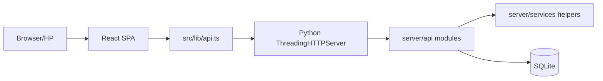
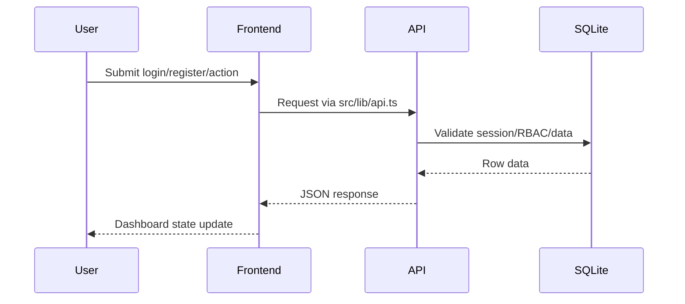
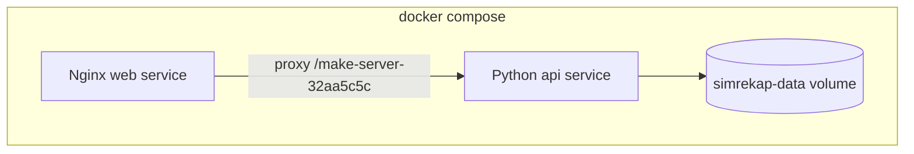

# Architecture

SIMREKAP adalah single-page application React yang berkomunikasi dengan backend Python HTTP server melalui API prefix tetap `/make-server-32aa5c5c`.

## Runtime Overview



## Frontend

Entry point:

- `src/main.tsx`
- `src/app/App.tsx`
- `src/lib/api.ts`

Struktur domain:

- `src/app/components/landing/` untuk landing page.
- `src/app/components/user/` untuk dashboard relawan/KSH.
- `src/app/components/moderator/` untuk dashboard moderator.
- `src/app/components/admin/` untuk dashboard admin.
- `src/app/components/ui/` untuk reusable UI primitives dan navbar.

Routing menggunakan state di `App.tsx`, bukan React Router. Path publik seperti `/login`, `/register`, `/access`, `/admin`, dan `/app` dipetakan ke page state.

Session token disimpan di `localStorage` dengan key `simrp_auth_token`. Saat app dibuka, frontend memanggil `/auth/me` untuk memvalidasi token dan mengambil role terbaru dari server.

## Backend

Entry point:

- `server/main.py`

Tanggung jawab `server/main.py`:

- load `.env.local` dan `.env`;
- membaca konfigurasi runtime;
- membuka koneksi SQLite;
- menjalankan schema, migration, dan seed;
- memasang CORS, security headers, body limit, rate limit;
- membaca bearer session token;
- mendispatch request ke `server/api/*`.

Modul API aktif:

- `auth.py`
- `users.py`
- `events.py`
- `reports.py`
- `access_requests.py`
- `admin.py`
- `collaboration.py`
- `notifications.py`
- `certificates.py`
- `rewards.py`
- `geographic.py`

Modul pendukung:

- `server/db/schema.py`
- `server/db/migrations.py`
- `server/db/seed.py`
- `server/services/runtime.py`
- `server/services/rate_limiter.py`
- `server/core/utils.py`
- `server/core/config.py`

## Data Flow



## Main Workflows

Event:

```text
draft -> approved -> published -> completed
```

Report:

```text
pending -> under_review -> verified/rejected
```

Access request:

```text
pending -> approved/rejected
```

Verified report triggers:

- XP calculation;
- `xp_kelurahan` update;
- `xp_pillar` update;
- certificate creation;
- notification;
- audit log.

## Storage

Runtime SQLite:

```text
database/runtime/database.db
```

Sample/reference:

```text
database/sample/simrekap_demo.sqlite
database/schema/simrekap_schema.sql
```

Runtime DB di-ignore karena dapat berisi session dan credential state. Sample DB aman dibuat dari seed bersih.

## Docker Architecture



Port host default:

```text
7761 -> web:80
```
