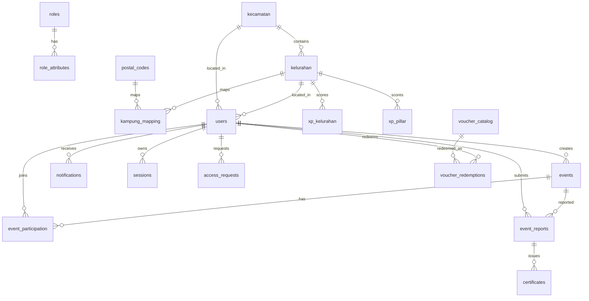

# Database Schema

SIMREKAP memakai SQLite untuk prototype/KP/demo. Runtime database default berada di `database/runtime/database.db` dan tidak di-commit. Struktur database terdokumentasi di file ini dan diekspor sebagai SQL di `database/schema/simrekap_schema.sql`.

## ERD Ringkas



## Tabel Utama

| Tabel | Fungsi |
|---|---|
| `roles` | Master role |
| `role_attributes` | Atribut tambahan role |
| `kecamatan` | Master kecamatan |
| `kelurahan` | Master kelurahan |
| `postal_codes` | Master kodepos |
| `kampung_mapping` | Mapping kelurahan-kodepos |
| `users` | Akun, role, wilayah, points, badge |
| `otp_challenges` | Challenge OTP mode provider-ready |
| `access_requests` | Pengajuan akses KSH/moderator |
| `events` | Data kegiatan |
| `event_participation` | Join/attendance/report participation |
| `event_reports` | Laporan kegiatan |
| `xp_kelurahan` | Total XP kelurahan |
| `xp_pillar` | XP empat pilar |
| `audit_logs` | Audit aksi penting |
| `collaboration_requests` | Pengajuan mitra |
| `notifications` | Notifikasi user |
| `certificates` | Sertifikat digital |
| `voucher_catalog` | Katalog voucher |
| `voucher_redemptions` | Riwayat redeem voucher |
| `sessions` | Token session server-side |
| `temporary_adjustments` | Adjustment sementara |

## Lifecycle Data

- User dibuat melalui signup, seed, atau admin bootstrap.
- Role petugas dapat berubah melalui access request/admin approval.
- Event dibuat sebagai draft, lalu approved, published, completed.
- Participation dibuat saat user join event.
- Report dibuat setelah event completed dan user attended.
- Report verified memicu XP, certificate, notification, dan audit log.
- Voucher redeem mengurangi XP dan stok server-side.
- Session dan OTP adalah runtime data; tidak boleh dipakai sebagai sample publik.

## Index Penting

- `idx_access_requests_requester_status`
- `idx_access_requests_status_created`
- `idx_access_requests_pending_role`
- Unique participation: `(event_id, user_id)`
- Unique certificate: `(user_id, event_id)`
- Unique XP pillar: `(kelurahan_id, pillar)`

## Sample Database

Repository menyediakan sample DB aman:

```text
database/sample/simrekap_demo.sqlite
```

Sample DB dibuat dari seed bersih. Tabel runtime sensitif seperti `sessions`, `otp_challenges`, `audit_logs`, dan `notifications` dikosongkan.

## Catatan Produksi

SQLite cocok untuk prototype dan demo. Untuk produksi publik dengan banyak pengguna, pertimbangkan PostgreSQL/MySQL sesuai catatan di `docs/DATABASE_MIGRATION_NOTES.md`.
