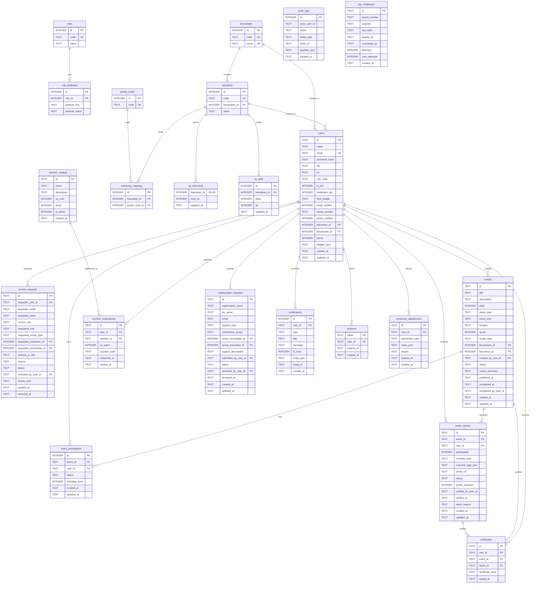

# ERD Visual & Data Dictionary SIMREKAP

Dokumen ini berisi diagram Entity-Relationship (ERD) visual lengkap berbasis **Mermaid.js** yang diekstrak langsung dari skema database resmi `database/schema/simrekap_schema.sql`.

---

## 1. Diagram Visual ERD (Mermaid)

---

## 2. Indeks & Unique Constraints Penting

- `access_requests`: Unique Index `idx_access_requests_pending_role` pada `(requester_user_id, requested_role)` WHERE status = 'pending'.
- `event_participation`: Unique Constraint `UNIQUE(event_id, user_id)` (mencegah duplicate join).
- `certificates`: Unique Constraint `UNIQUE(user_id, event_id)` (satu sertifikat per event per user).
- `xp_pillar`: Unique Constraint `UNIQUE(kelurahan_id, pillar)`.
- `kampung_mapping`: Unique Constraint `UNIQUE(kelurahan_id, postal_code_id)`.
